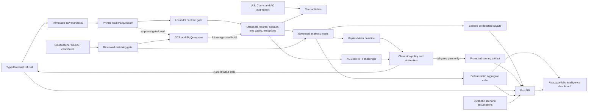

# Architecture

## Local release path

The release container serves a compiled React client and versioned FastAPI contracts from one
unprivileged process. Portfolio and cohort endpoints read a deidentified, aggregate-only SQLite seed
in read-only mode. The scenario endpoint is a pure deterministic calculation. Forecast and
milestone-event paths terminate in typed refusal or unavailability responses. No release request can
reach the private DuckDB warehouse, source archives, review packets, cloud services, or a model.

## Decision flow

## Analytics interface architecture

The interface uses one global portfolio scope instead of independent report filters. District, case-family, filing-period, and procedural-cohort state are reflected in the URL and drive every supported dashboard panel. Pure TypeScript selectors derive the selected portfolio slice, annual filing series, pending-age series, district ranking, case-family ranking, and latest complete-year change from the versioned cube. The same selected evidence is included in the exported JSON view.

`App.tsx` owns API loading, URL state, export, workspace navigation, and scenario requests. `AnalyticsDashboard.tsx` owns analytical composition and chart rendering. `population.ts` contains deterministic selection and ranking logic without browser or presentation dependencies. The FastAPI service remains the typed runtime boundary, while the static Pages build loads the identical cube directly. Neither path can access private data.

The synthetic scenario engine is a connected secondary workspace rather than the product's primary claim. It accepts bounded user assumptions and returns deterministic sensitivity cases. It does not consume the selected portfolio as an implied forecast, observed cost, or recommended staffing plan.

## Data boundary

FJC defines population. Pending cases remain pending with an explicit censoring date. CourtListener data enriches only reviewed matches. AO tables validate aggregates but never substitute for case-level data. Raw identifiers remain private. Seeded demo uses stable opaque identifiers and no live warehouse access.

M3 verifies the local raw boundary over the complete FJC archive. It selects approved metadata fields before text decoding, excludes party and judge fields, requires strict UTF-8 for selected values, partitions 2010 onward rows by filing year, and quarantines structural failures. Accepted, pre-window excluded, and quarantined counts must equal all source rows.

M4 runs dbt Core against the private Parquet source through a private DuckDB development target. Staging preserves raw and provenance fields. Intermediate models derive event observation, right censoring, duration, exact nature-of-suit mappings, and natural-key collision status. Marts separate all statistical records from collision-free case records and identity exceptions. Contracts, source freshness, relationships, reconciliation tests, and an expected contract failure gate run locally and in CI. The DuckDB target is development evidence only. BigQuery execution, cloud lineage, and deployed partition behavior remain unverified.

M5 stages only reviewed one-to-one FJC and RECAP matches. M6 builds portfolio, filing-cohort, pending-inventory, duration-summary, comparable-case, and data-coverage marts. Aggregate views retain the complete statistical population. Record-level comparables retain only collision-free cases. RECAP identity contributes availability flags and provenance, not duration truth. Two dbt exposures define portfolio and future modeling consumers.

M7 evaluates Kaplan-Meier and XGBoost AFT locally against the private comparable-case mart. A versioned contract fixes intake-known features, calendar splits, support rules, evaluation horizons, bootstrap comparison, and shipping gates. Both estimators fail required calibration, so the architecture stops at descriptive marts and does not expose a scoring path. Private evaluation and model files are retained only as negative evidence.

## Delivery boundary

Local checks and source-controlled contracts are authorized. Private generated dbt documentation and the local warehouse remain outside Git. Existing cloud state is not assumed accurate. Any reconciliation is read-only and separately documented. New cloud provisioning, spend, deployment targets, and repository write actions require explicit owner approval; the current static dashboard and tagged release were published through those gates.

## Failure policy

Schema failures quarantine data. Match ambiguity blocks enrichment. Failed baseline limits product to descriptive analytics. Failed challenger retains Kaplan-Meier. Missing or incompatible model artifacts fail readiness. Sparse cohorts receive abstention, never a forced estimate.
