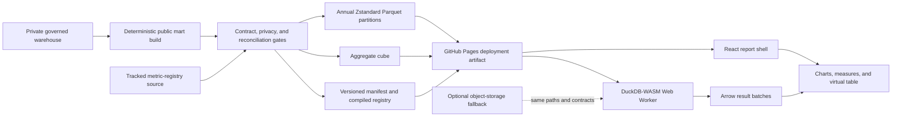

# Row-level analytics release plan

## Status and outcome

This plan records the implemented v2.0 release. The dashboard provides governed analytical access to
all 5,008,334 statistical records and a Power BI-style report workspace while preserving the
zero-dollar operating ceiling and its aggregate fast path.

The target outcome is a portfolio analyst who can move from an executive measure to a chart, a
district or case-family slice, and finally the supporting analytical records without leaving one
synchronized report context. Historical evidence remains descriptive. Duration forecasts remain
disabled, and synthetic scenarios remain explicitly separate from observed data.

## Publication contract

"Full row-level" means the complete statistical-record population with a narrow, approved analytical
schema. It does not mean an unrestricted copy of the source archive. M15 freezes the fields below.

The M15-approved public serving mart includes:

- an opaque row key produced by release-scoped HMAC-SHA-256 so approved replays preserve keys and
  bytes without publishing the private source identity or key material;
- circuit and district codes, with office code excluded;
- month-precision filing and termination dates plus the source-snapshot date;
- pending status, event-observation status, and descriptive duration;
- nature-of-suit code, family, and mapping status;
- jurisdiction, origin, and governed procedural cohort;
- identity-quality status and source-record count;
- reviewed RECAP match-availability status, without RECAP identifiers; and
- publication version and provenance fields.

It will exclude docket numbers, PACER identifiers, case names, party names, judges, attorneys,
document or docket-entry text, private source identifiers, credentials, review packets, model
artifacts, and private reconciliation evidence. Collision records remain present as statistical
records and are visibly labeled. They are never represented as canonical case identities.

## Target architecture

The implemented design is a zero-cost static lakehouse. GitHub Pages serves the application shell and
existing aggregate cube. M17 selected the browser architecture after local range validation and
read-only probes of existing public assets. M22 verified the exact Parquet behavior at an approved
Cloudflare candidate before the immutable prefix and read-only Worker were activated for production.
DuckDB-WASM runs in a
Web Worker, reads only required Parquet row groups, and returns Arrow batches to the React interface.
ECharts renders visual results, and a virtualized table renders record results without placing all
rows in the document.

The aggregate cube remains the fast path for the initial report and common executive measures. Row
queries use annual partitions, column projection, predicate pushdown, row-group pruning, bounded
result sets, and cancellation. A normal interaction must not download the complete dataset. The
frontend uses one configurable `DATA_BASE_URL`, so a future object-storage fallback can replace the
Pages data origin without changing metrics or report behavior.

GitHub Pages is the leading candidate because the projected serving mart is well below its documented
1 GB site limit and the project already uses Pages. The design treats its 100 GB monthly bandwidth limit
as a monitored operating boundary, not an entitlement. Data files stay out of Git history and enter
only the generated Pages deployment artifact and, if useful, a versioned release download. See
[GitHub Pages limits](https://docs.github.com/en/pages/getting-started-with-github-pages/github-pages-limits)
and [GitHub large-file guidance](https://docs.github.com/en/repositories/working-with-files/managing-large-files/about-large-files-on-github).

DuckDB-WASM is the baseline query engine because it can query Parquet directly in the browser. Its
WebAssembly memory ceiling and default single-threaded execution make memory, cancellation, and
mobile testing release gates. See the [DuckDB-WASM overview](https://duckdb.org/docs/stable/clients/wasm/overview).
M17 pins version 1.29.0 and disables full HTTP fallback because version 1.32.0 failed the representative
HTTP path and has an open upstream range regression. Any upgrade must replay the M17 corpus.
Cloudflare R2 is an overflow option only. Its free allowance is useful, but adopting it adds an
external service and operational surface. See [R2 pricing](https://developers.cloudflare.com/r2/pricing/).

## Analytical model

A tracked, versioned metric-registry source is the single semantic source for measure identifiers, labels, formulas,
formats, support rules, descriptions, limitations, and allowed dimensions. Report components request
registered measures rather than constructing independent formulas. The same registry drives chart
tooltips, table headers, exported metadata, methodology text, and reconciliation tests. Its compiled
deployment copy is generated with the application and data manifest.

The private warehouse remains normalized and audit-oriented. The public serving mart is deliberately
narrow and denormalized for browser scans. The mart is sorted by filing year, district, nature family,
and opaque row key, then partitioned by filing year. M17 selected a 65,536-row group for the
representative complete-year slice and recorded its limitations.

## Report experience

The report shell will provide synchronized slicers for district, circuit, filing period, termination
period, pending status, nature family, jurisdiction, origin, and procedural cohort. Filters, selected
marks, breadcrumbs, and shareable URL state form one report context. Cross-filtering and drill-through
must be keyboard operable and must always show active scope.

The planned report pages are:

1. **Executive overview:** filings, terminations, pending inventory, descriptive duration, year change,
   concentration, and data coverage.
2. **Filing trends:** annual and monthly volume, composition, and period comparison.
3. **Pending inventory and aging:** open-record counts, aging bands, district mix, and cohort context.
4. **Case mix:** nature family, jurisdiction, origin, and procedural-cohort composition.
5. **District comparison:** sortable workload measures, comparison distributions, and drill-through.
6. **Record explorer:** virtualized row table, column picker, pinning, sorting, detail drawer, and bounded
   exports.
7. **Data quality and coverage:** mapping support, identity collisions, RECAP availability, suppression,
   source date, and reconciliation status.
8. **Scenario lab and methods:** synthetic staffing and budget sensitivity plus metric definitions,
   provenance, and capability refusals.

The record explorer will never render an unbounded result. It starts with projected columns, applies a
deterministic default sort, pages or streams bounded Arrow batches, displays total and returned counts,
and requires an explicit export action. CSV export is bounded and spreadsheet-safe. Filtered Parquet
is preferred for large analytical exports. Each successful bounded export prepares a deterministic
JSON provenance sidecar with its scope and contract versions. A separate full-dataset download exposes
the exact released partitions and manifest.

## Milestone plan

| Milestone | Depends on | Deliverable | Exit criteria |
| --- | --- | --- | --- |
| M15 | M14 | Publication contract | Approved allowlist and denylist, privacy and threat review, dataset versioning, stable opaque-key rule, export policy, and zero prohibited fields in a contract fixture. |
| M16 | M6, M15, M17 | Row-level serving mart | Exactly 5,008,334 rows across deterministic annual Parquet partitions; all collision rows retained and labeled; exact reconciliation to the aggregate cube; reproducible manifest and integrity metadata. |
| M17 | M6, M15 | Browser query benchmark | One representative annual partition works end to end locally through DuckDB-WASM in a Web Worker; measured bytes, cold and warm latency, peak memory, cancellation, desktop/mobile behavior, and read-only host probes select a provisional partition and hosting policy without public upload. |
| M18 | M15, M17 | Semantic model | Tracked versioned metric registry, safe query templates, dimension compatibility, support rules, metric tests, and generated user-facing definitions. |
| M19 | M17, M18 | Report workspace | Eight-page responsive shell, synchronized slicers, cross-filtering, drill-through, shareable URL state, bookmarks, loading and failure states, and aggregate fast path. |
| M20 | M16, M18, M19 | Record explorer and export | Virtualized row table, column controls, deterministic sorting, details, bounded CSV, verified filtered Parquet or refusal, separate full dataset download, and provenance sidecar. |
| M21 | M16, M19, M20 | Reliability, performance, and accessibility | Query budgets, cancellation and recovery, cache behavior, mobile memory, browser compatibility, security boundary, keyboard operation, WCAG 2.2 AA checks, and projected zero-cost envelope pass. |
| M22 | M21 | Row-level release | Fresh approval before candidate deployment, deterministic rebuild, public-boundary scan, exact reconciliation, production build, generated static assets, live smoke test, rollback rehearsal, actual cost verification, documentation, and final publication decision pass. |

M15 through M21 are complete locally. M16 produced two byte-identical private candidates with
5,008,334 rows, 362,615 collision labels, 457,327 pending records, 17 annual partitions, exact
aggregate reconciliation, and 104,725,737 total bytes. M18 registers 11 measures and 17 dimensions,
maps every aggregate measure field, and reconciles 8,970 supported slices exactly. M19 adds eight
responsive destinations, one synchronized aggregate report context, URL round-trips, bookmarks, and
explicit recovery states. M20 adds one-partition bounded queries, deterministic page boundaries,
projected and virtualized rows, key detail, formula-safe CSV, verified filtered Parquet, and the
explicit complete-data path. M21 adds fail-closed manifest and origin validation, bounded worker
recovery, exact-origin range service, aggregate rollback, responsive and accessibility hardening, and
complete private candidate scans. Its browser corpus recovers after every cancellation with zero memory
failures or unintended full fetches; the combined Pages application and data candidate is 185,528,442 bytes
and recurring infrastructure cost remains $0.

M22 completed verification and production reconciliation. The exact 38-file,
185,759,334-byte inventory matches the privately recorded frozen digest; all live files match the frozen
manifest, the representative browser query p95 is 2,256 ms, provider rollback and restoration pass,
and reconciled incremental cost is $0 under the measured free-tier usage. All 33 frozen checks pass.
The aggregate cube remains active as the initial-render fast path and safe fallback.

## Release gates

| Gate | Required result |
| --- | --- |
| Population | Exactly 5,008,334 statistical rows in the released mart. |
| Privacy | Zero prohibited fields, identifiers, text fields, credentials, or private evidence. |
| Identity truth | Every collision record retained and labeled; no collision presented as a canonical case. |
| Reconciliation | Released row aggregates equal the approved cube for every published measure and supported slice. |
| Initial load | Application shell and aggregate overview usable within 2.5 seconds on the reference profile. |
| Typical query | Under 3 seconds cold and 1 second warm for the declared representative filtered workload. |
| Transfer | Ordinary queries read only required partitions and columns, never the full dataset. |
| Memory | No out-of-memory failure on supported desktop and mobile profiles. |
| Accessibility | Zero automated accessibility violations plus completed keyboard and screen-reader review. |
| Artifact | Pages deployment artifact remains below 250 MB. |
| Cost | Recurring infrastructure cost remains $0 under the declared usage profile. |
| Portability | Changing `DATA_BASE_URL` switches the data origin without changing report semantics. |

M17 used Chrome 151 on a 1440 by 900 desktop viewport and a 390 by 844 mobile viewport, on the same
10-logical-core host with unthrottled loopback networking. The measure, grouped chart, 100-row page,
and 200-row sort corpus recorded a worst cold p95 of 27.7 ms and warm p95 of 10.6 ms. The maximum
observed JavaScript heap was 17,197,661 bytes with zero memory failures. Both profiles transferred
6,196,296 bytes across the complete run, used only HTTP 206 data responses, and produced zero
unintended full fetches. The aggregate production shell LCP was 120 ms. The production row origin
passes exact Parquet HTTPS, MIME, CORS, byte-range, immutable-cache, and zero-redirect checks.

## Reliability, security, and rollback

- The manifest pins dataset version, schema version, row count, partition paths, byte sizes, checksums,
  snapshot cutoff, metric-registry version, and minimum supported application version.
- Build and promotion verify full-file integrity before assets become reachable. The application
  validates manifest and schema compatibility before range-based queries; it verifies a full-file
  checksum only during an explicit complete download.
- Query templates allow only registered dimensions, measures, operators, sorts, and bounded limits.
- The worker enforces cancellation and a result-row ceiling; the UI preserves filter state through
  recoverable worker restarts.
- A service worker may cache the shell, manifest, registry, and aggregate cube. Row partitions use
  versioned immutable paths and browser HTTP caching rather than unbounded offline prefetch.
- Rollback republishes the last verified application and data manifest together. A partial data publish
  must never become the active manifest. Activation and restoration use a cache-busting shell request
  so stale HTML cannot reference a superseded hashed bundle.
- The approved M22 deployment packages the compiled registry, manifest, and partitions under one
  immutable R2 prefix served by a read-only Worker. Failed row activation leaves the aggregate
  application active.

## Release decision

M22 verification is complete and the final publication decision is PASS. The exact verified inventory
is active through the production row-data Worker, GitHub Pages points to that origin, and release v2.0
supersedes the earlier HOLD decisions. The aggregate path remains available for initial rendering and
fail-closed recovery.
