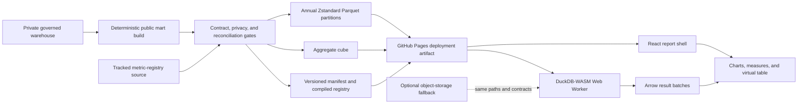

# Row-level analytics release plan

## Status and outcome

This is the approved implementation plan for the next release. It is not a claim about the current
live product. The v1.1 dashboard remains a full-population aggregate explorer. The next release will
add governed analytical access to all 5,008,334 statistical records and a Power BI-style report
workspace while preserving the zero-dollar operating ceiling.

The target outcome is a portfolio analyst who can move from an executive measure to a chart, a
district or case-family slice, and finally the supporting analytical records without leaving one
synchronized report context. Historical evidence remains descriptive. Duration forecasts remain
disabled, and synthetic scenarios remain explicitly separate from observed data.

## Publication contract

"Full row-level" means the complete statistical-record population with a narrow, approved analytical
schema. It does not mean an unrestricted copy of the source archive. The fields below are candidates;
M15 decides their final inclusion, exactness, and coarsening.

The candidate public serving mart includes:

- an opaque row key produced by a deterministic privately keyed pseudonym or a persisted release-scoped
  random mapping so approved replays preserve keys and bytes;
- circuit, district, and office codes;
- filing, termination, censoring, and source-snapshot dates;
- pending status, event-observation status, and descriptive duration;
- nature-of-suit code, family, and mapping status;
- jurisdiction, origin, and governed procedural cohort;
- identity-quality status and source-record count;
- reviewed RECAP match-availability status, without RECAP identifiers; and
- publication version and provenance fields.

It will exclude docket numbers, PACER identifiers, case names, party names, judges, attorneys,
document or docket-entry text, private source identifiers, credentials, review packets, model
artifacts, and private reconciliation evidence. Collision records remain present as statistical
records and are visibly labeled. They are never represented as canonical case identities.

## Target architecture

The baseline design is a zero-cost static lakehouse. GitHub Pages continues to serve the application
shell and existing aggregate cube. Its suitability for the versioned manifest and compact Zstandard
Parquet partitions remains provisional until M17 and the approved M22 live candidate verify it.
DuckDB-WASM runs in a
Web Worker, reads only required Parquet row groups, and returns Arrow batches to the React interface.
ECharts renders visual results, and a virtualized table renders record results without placing all
rows in the document.

The aggregate cube remains the fast path for the initial report and common executive measures. Row
queries use annual partitions, column projection, predicate pushdown, row-group pruning, bounded
result sets, and cancellation. A normal interaction must not download the complete dataset. The
frontend uses one configurable `DATA_BASE_URL`, so a future object-storage fallback can replace the
Pages data origin without changing metrics or report behavior.

GitHub Pages is the leading candidate because the projected serving mart is well below its documented
1 GB site limit and the project already uses Pages. The design treats its 100 GB monthly bandwidth limit
as a monitored operating boundary, not an entitlement. Data files stay out of Git history and enter
only the generated Pages deployment artifact and, if useful, a versioned release download. See
[GitHub Pages limits](https://docs.github.com/en/pages/getting-started-with-github-pages/github-pages-limits)
and [GitHub large-file guidance](https://docs.github.com/en/repositories/working-with-files/managing-large-files/about-large-files-on-github).

DuckDB-WASM is the baseline query engine because it can query Parquet directly in the browser. Its
WebAssembly memory ceiling and default single-threaded execution make memory, cancellation, and
mobile testing release gates. See the [DuckDB-WASM overview](https://duckdb.org/docs/stable/clients/wasm/overview).
Cloudflare R2 is an overflow option only. Its free allowance is useful, but adopting it adds an
external service and operational surface. See [R2 pricing](https://developers.cloudflare.com/r2/pricing/).

## Analytical model

A tracked, versioned metric-registry source is the single semantic source for measure identifiers, labels, formulas,
formats, support rules, descriptions, limitations, and allowed dimensions. Report components request
registered measures rather than constructing independent formulas. The same registry drives chart
tooltips, table headers, exported metadata, methodology text, and reconciliation tests. Its compiled
deployment copy is generated with the application and data manifest.

The private warehouse remains normalized and audit-oriented. The public serving mart is deliberately
narrow and denormalized for browser scans. The mart is sorted by filing year, district, nature family,
and opaque row key, then partitioned by filing year. M17 benchmarks a matrix of row-group and file-size
policies and records the selected policy with its limitations.

## Report experience

The report shell will provide synchronized slicers for district, circuit, filing period, termination
period, pending status, nature family, jurisdiction, origin, and procedural cohort. Filters, selected
marks, breadcrumbs, and shareable URL state form one report context. Cross-filtering and drill-through
must be keyboard operable and must always show active scope.

The planned report pages are:

1. **Executive overview:** filings, terminations, pending inventory, descriptive duration, year change,
   concentration, and data coverage.
2. **Filing trends:** annual and monthly volume, composition, and period comparison.
3. **Pending inventory and aging:** open-record counts, aging bands, district mix, and cohort context.
4. **Case mix:** nature family, jurisdiction, origin, and procedural-cohort composition.
5. **District comparison:** sortable workload measures, comparison distributions, and drill-through.
6. **Record explorer:** virtualized row table, column picker, pinning, sorting, detail drawer, and bounded
   exports.
7. **Data quality and coverage:** mapping support, identity collisions, RECAP availability, suppression,
   source date, and reconciliation status.
8. **Scenario lab and methods:** synthetic staffing and budget sensitivity plus metric definitions,
   provenance, and capability refusals.

The record explorer will never render an unbounded result. It starts with projected columns, applies a
deterministic default sort, pages or streams bounded Arrow batches, displays total and returned counts,
and requires an explicit export action. CSV export is bounded and spreadsheet-safe. Filtered Parquet
is preferred for large analytical exports. A separate full-dataset download exposes the exact released
partitions and manifest.

## Milestone plan

| Milestone | Depends on | Deliverable | Exit criteria |
| --- | --- | --- | --- |
| M15 | M14 | Publication contract | Approved allowlist and denylist, privacy and threat review, dataset versioning, stable opaque-key rule, export policy, and zero prohibited fields in a contract fixture. |
| M16 | M6, M15, M17 | Row-level serving mart | Exactly 5,008,334 rows across deterministic annual Parquet partitions; all collision rows retained and labeled; exact reconciliation to the aggregate cube; reproducible manifest and integrity metadata. |
| M17 | M6, M15 | Browser query benchmark | One representative annual partition works end to end locally through DuckDB-WASM in a Web Worker; measured bytes, cold and warm latency, peak memory, cancellation, desktop/mobile behavior, and read-only host probes select a provisional partition and hosting policy without public upload. |
| M18 | M15, M17 | Semantic model | Tracked versioned metric registry, safe query templates, dimension compatibility, support rules, metric tests, and generated user-facing definitions. |
| M19 | M17, M18 | Report workspace | Eight-page responsive shell, synchronized slicers, cross-filtering, drill-through, shareable URL state, bookmarks, loading and failure states, and aggregate fast path. |
| M20 | M16, M18, M19 | Record explorer and export | Virtualized row table, column controls, deterministic sorting, details, bounded CSV, verified filtered Parquet or refusal, separate full dataset download, and provenance sidecar. |
| M21 | M16, M19, M20 | Reliability, performance, and accessibility | Query budgets, cancellation and recovery, cache behavior, mobile memory, browser compatibility, security boundary, keyboard operation, WCAG 2.2 AA checks, and projected zero-cost envelope pass. |
| M22 | M21 | Row-level release | Fresh approval before candidate deployment, deterministic rebuild, public-boundary scan, exact reconciliation, production build, generated static assets, live smoke test, rollback rehearsal, actual cost verification, documentation, and final publication decision pass. |

M15 is the first milestone. After M15, M17 is the next unblocked milestone. M16 must not scale the full build until the M17 vertical slice demonstrates
that the intended browser architecture is operationally safe. M18 can proceed against the same slice
after M15 freezes the publication contract. M19 and M20 consume the frozen semantic and data contracts.
M22 requires M15 through M21.

## Release gates

| Gate | Required result |
| --- | --- |
| Population | Exactly 5,008,334 statistical rows in the released mart. |
| Privacy | Zero prohibited fields, identifiers, text fields, credentials, or private evidence. |
| Identity truth | Every collision record retained and labeled; no collision presented as a canonical case. |
| Reconciliation | Released row aggregates equal the approved cube for every published measure and supported slice. |
| Initial load | Application shell and aggregate overview usable within 2.5 seconds on the reference profile. |
| Typical query | Under 3 seconds cold and 1 second warm for the declared representative filtered workload. |
| Transfer | Ordinary queries read only required partitions and columns, never the full dataset. |
| Memory | No out-of-memory failure on supported desktop and mobile profiles. |
| Accessibility | Zero automated accessibility violations plus completed keyboard and screen-reader review. |
| Artifact | Pages deployment artifact remains below 250 MB. |
| Cost | Recurring infrastructure cost remains $0 under the declared usage profile. |
| Portability | Changing `DATA_BASE_URL` switches the data origin without changing report semantics. |

M17 must replace provisional performance targets with a pinned reference device, browser versions,
query corpus, network profile, measured results, and limitations before M21 can close. Exact public
Parquet URL behavior remains an M22 live-candidate gate after deployment receives fresh approval.

## Reliability, security, and rollback

- The manifest pins dataset version, schema version, row count, partition paths, byte sizes, checksums,
  snapshot cutoff, metric-registry version, and minimum supported application version.
- Build and promotion verify full-file integrity before assets become reachable. The application
  validates manifest and schema compatibility before range-based queries; it verifies a full-file
  checksum only during an explicit complete download.
- Query templates allow only registered dimensions, measures, operators, sorts, and bounded limits.
- The worker enforces cancellation and a result-row ceiling; the UI preserves filter state through
  recoverable worker restarts.
- A service worker may cache the shell, manifest, registry, and aggregate cube. Row partitions use
  versioned immutable paths and browser HTTP caching rather than unbounded offline prefetch.
- Rollback republishes the last verified application and data manifest together. A partial data publish
  must never become the active manifest.
- After fresh M22 deployment approval, the private build packages application, compiled registry,
  manifest, and partitions into an immutable candidate deployment or approved object-store prefix.
  Live checks run against that inactive candidate. Only a passing candidate manifest becomes active;
  failure restores the prior manifest and aggregate application.

## First implementation slice

The next implementation session should complete M15 and the smallest useful part of M17:

1. freeze `public-row-mart.v1` and the prohibited-field policy;
2. build one representative annual partition from the private statistical-record mart;
3. load that partition through DuckDB-WASM in a Web Worker;
4. run a small query corpus covering a measure, grouped chart result, row page, sort, and cancellation;
5. record transfer bytes, cold and warm latency, peak memory, desktop and mobile behavior;
6. decide partition size, row-group size, caching policy, and a provisional data-origin policy; and
7. stop before a full data build, upload, deployment, or publication unless its gate is explicitly approved.
